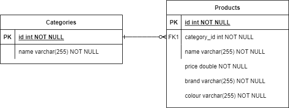

# Spring Boot iCommerce Web App
### About
This is a simple backend project for online shopping application.

Customers can filter products by multiple criteria. Each customer has his own shopping cart.

The application was made using Spring Boot, Spring Data JPA, RESTful API. Database is in memory H2.

### Folder Structure
```
demo
├── domain     > contain all classes that get stored in a database 
├── repository > contain all classes that interact with database and do the operations
├── service    > contain all classes that hold business logic
└── web
    └── rest   > contain all restful API classes that expose business to clients
```

### Entity relationship diagram:
 

### 1. To run the application, run the following command in a terminal:
>./mvnw spring-boot:run

### 2. Dummy data will be automatically inserted to the H2 database as soon as the application has started. Using the following curls: 
* To search products by category, price, brand or colour: 
>curl --location --request GET 'localhost:8080/api/products?name=duct&category=1,2'


* To add a product to shopping cart: you need a client-id in the request header and a product ID in request body
>curl --location --request POST 'localhost:8080/api/carts' \
--header 'x-client-id: 1000001' \
--header 'Content-Type: application/json' \
--data-raw '3'